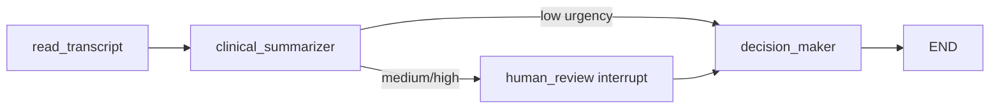

<<<<<<< HEAD
# Medical Triage Multi-Agent Prototype

LangGraph multi-agent clinical triage backend with FastAPI and a Streamlit demo UI.

## Architecture



| Component | Role |
|-----------|------|
| `read_transcript_node` | Loads MTS-Dialog `dialogue` by row index |
| `clinical_summarizer_node` | Structured Llama extraction → `PatientClassification` |
| `human_review_node` | `interrupt()` for doctor approval (medium/high urgency) |
| `decision_maker_node` | Senior-doctor treatment decision report |

## Setup

```bash
python -m venv .venv
.venv\Scripts\activate          # Windows
pip install -r requirements.txt
copy .env.example .env          # add HUGGINGFACEHUB_API_TOKEN (+ optional LangSmith keys)
```

## Run backend

```bash
uvicorn backend.main:app --reload --host 127.0.0.1 --port 8000
```

## API

### `POST /start_triage`

```json
{ "dialogue_index": 0 }
```

Returns `status: "completed"` for low urgency, or `status: "awaiting_approval"` with `thread_id` when interrupted.

### `POST /approve_triage`

```json
{ "thread_id": "<uuid>", "approved": true }
```

Resumes the graph into `decision_maker_node` and returns the final `decision_report`.

## Run Streamlit (optional)

```bash
streamlit run frontend/app.py
```

## Data

Clinical dialogues are loaded from the [MTS-Dialog validation set](https://raw.githubusercontent.com/abachaa/MTS-Dialog/main/Main-Dataset/MTS-Dialog-ValidationSet.csv) via pandas (`dialogue` column).
=======
# AI_triage
>>>>>>> 1becbec95f1e8713729ebd8a363b24c5bee7f6ee
