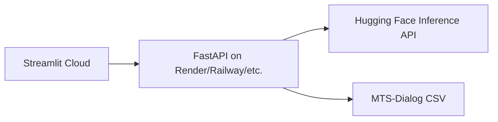

# Medical Triage Multi-Agent Prototype

LangGraph multi-agent clinical triage backend with FastAPI and a Streamlit demo UI.

Live demo: [aihealthtriage.streamlit.app](https://aihealthtriage.streamlit.app/)

## Tech stack

| Layer | Technology |
|-------|------------|
| Frontend | [Streamlit](https://streamlit.io/) (Streamlit Cloud) |
| API | [FastAPI](https://fastapi.tiangolo.com/) + [Uvicorn](https://www.uvicorn.org/) (Render) |
| Agent orchestration | [LangGraph](https://langchain-ai.github.io/langgraph/) |
| LLM integration | [LangChain Hugging Face](https://python.langchain.com/docs/integrations/chat/huggingface/) |
| Model hosting | [Hugging Face Inference API](https://huggingface.co/inference-api) (Llama) |
| Observability | [LangSmith](https://smith.langchain.com/) (optional) |
| Structured output | [Pydantic](https://docs.pydantic.dev/) |
| Data loading | [pandas](https://pandas.pydata.org/) |
| Session persistence | LangGraph `MemorySaver` checkpointer |
| Dataset | [MTS-Dialog](https://github.com/abachaa/MTS-Dialog) validation CSV |

## Architecture



| Component | Role |
|-----------|------|
| `frontend/app.py` | Streamlit UI (deployed to Streamlit Cloud) |
| `backend/main.py` | FastAPI API (must be deployed separately) |
| `clinical_summarizer_node` | Structured Llama extraction |
| `human_review_node` | Doctor review + editable classification |
| `decision_maker_node` | Treatment decision report |

## Local setup

```bash
python -m venv .venv
pip install -r requirements.txt
copy .env.example .env
```

Add your `HUGGINGFACEHUB_API_TOKEN` to `.env`.

### Run locally

```bash
uvicorn backend.main:app --reload --host 127.0.0.1 --port 8000
streamlit run frontend/app.py
```

## Cloud deployment

**Streamlit Cloud only runs the frontend.** FastAPI does not run inside Streamlit Cloud.

### 1. Deploy the FastAPI backend (Render example)

1. Push this repo to GitHub
2. Create a [Render](https://render.com) **Web Service** from the repo
3. Use `render.yaml` or set:
   - **Build:** `pip install -r requirements.txt`
   - **Start:** `uvicorn backend.main:app --host 0.0.0.0 --port $PORT`
4. Add environment variables on Render:
   - `HUGGINGFACEHUB_API_TOKEN` — your HF token
   - `HF_MODEL_ID` — optional
   - `CORS_ORIGINS` — `https://aihealthtriage.streamlit.app`
5. Copy the public URL (e.g. `https://ai-triage-api.onrender.com`)

### 2. Configure Streamlit Cloud

In [Streamlit Cloud](https://share.streamlit.io/) app settings:

- **Main file path:** `frontend/app.py`
- **Secrets** (Settings → Secrets):

```toml
TRIAGE_API_URL = "https://your-fastapi-service.onrender.com"
```

Redeploy the Streamlit app after saving secrets.

### 3. Verify

- Backend health: `https://your-api-url/health`
- Streamlit app should show your API URL under the title
- If you see connection errors, check CORS and `TRIAGE_API_URL`

## API

### `POST /start_triage`

```json
{
  "dialogue_index": 0,
  "thread_id": "client-generated-uuid"
}
```

The `thread_id` is generated by the Streamlit client (via `uuid`) for each observation selection and is passed to LangGraph as `configurable.thread_id` to isolate graph state across sessions.

### `POST /approve_triage`

```json
{
  "thread_id": "<uuid>",
  "approved": true,
  "classification": {
    "urgency": "medium",
    "patient_class": ["routine"],
    "topic": "Back pain",
    "summary": "..."
  }
}
```

### `POST /update_report`

```json
{
  "thread_id": "<uuid>",
  "decision_report": "Edited report text..."
}
```

## Data

Clinical dialogues are loaded from the [MTS-Dialog validation set](https://raw.githubusercontent.com/abachaa/MTS-Dialog/main/Main-Dataset/MTS-Dialog-ValidationSet.csv) via pandas (`dialogue` column). The loader samples 20 rows per run.

## Notes

- Each dashboard observation selection gets a fresh client-generated `thread_id` to prevent state leakage between cases.
- Session state uses in-memory `MemorySaver`; triage threads reset if the API restarts or scales to multiple instances.
- Free Render tiers sleep after inactivity; the first request may take 30–60 seconds.
